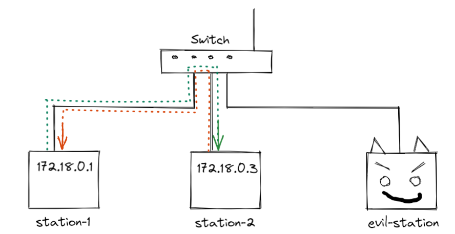
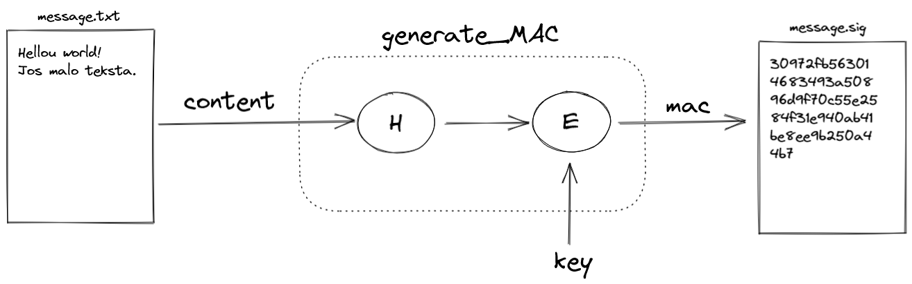

# Sigurnost računala i podataka

## Lab 1 - Man-in-the-middle attack (ARP spoofing)

### Cilj

Zadatak ove vježbe je da nas upozna s tipom MITM napada, ARP spoofing. Također da bi uspješno proveli vježbu upoznat ćemo se s osnovama linuxa i nekim njegovim alatima.

### Korištene tehnologije

- WSL(Windows Subsystem for Linux)
- Docker
- Git
- Linux alati
    - Netcat
    - Arpspoof

### Podizanje radne okoline

Prvo smo pokrenutilo WSL bash te smo u njemu izveli sljedeće naredbe.

Napravi novi direktorij s nazivom *bdurdo*. Zatim otvori taj direktorij i u njemu kloniraj GitHub repositorij.

```bash
mkdir bdurdo
cd bdurdo
git clone [https://github.com/mcagalj/SRP-2021-22](https://github.com/mcagalj/SRP-2021-22)
```

Zatim otvorimo *SRP-2021-22/arp-spoofing* direktorij te pokrenimo *.start.sh* koji će se pobrinuti za enviroment varijable, zaustavljanje i brisanje kontenjera ako postoje, izradu slika i pokretanje docker compose-a.

```bash
cd SRP-2021-22/
cd arp-spoofing/
./start.sh
```

Trenutno imamo podignuta 3 docker kontenjera koji su spojeni na zajedničku mrežu, te je okružje za laboratorijsku vježbu postavljeno.

Provjera jesu li kontenjeri stvarno podignuti

```bash
docker ps
```

Dodavanje više terminala na jednom prozoru → CTRL+SHIT+D

Pristupanje bash-u u svakom pojedinom pokrenutom kontenjeru

```bash
docker exec -it station-1 bash
docker exec -it station-2 bash
docker exec -it evil-station bash
```

Provjera konfiguracije mreže iz kontenjera

```bash
ifconfig -la
```

### Uspostavljanje komunikacije između servera

Provjera povezanosti kontenjera

```bash
ping station-2
```

Pokretanje netcat servera(*station-2*)

```bash
netcat -l -p 9000
```

Spajanje na netcat server(*station-1*)

```bash
netcat station-2 9000
```

Trenutno imamo spojen *station-1* i *station-2* te možemo razmjenjivati poruke između njih.



### ARP spoof napad

Slušanje prometa

```bash
tcp dump
```

Kad pokrenemo ovo na *evil-station* ne vidimo pakete jer nam se nitko ni ne obraća

Preusmjeravanje prometa

- -t → target, onaj koga varamo
- -h → host - onaj kim se predstavljam

```bash
arpspoof -t station-1 station-2
```

OUTPUT:

> 2:42:ac:12:0:4 2:42:ac:12:0:2 0806 42: arp reply 172.18.0.3 is-at 2:42:ac:12:0:4
> 

Što bi u prijevodu značilo govorim switchu da je na tome IP taj(u ovome slučaju moj) MAC

Filtriranje prometa od *host* i *station-1*(bez ARP paketa)

```bash
tcpdump -X host station-1 and not arp
```

Sada kad pošaljemo poruku možemo je vidjeti bez ostalih paketa.


Prekid prometa (između *station-1* i *station-1*)

```bash
echo 0 > /proc/sys/net/ipv4/ip_forward
```

Izlaz iz pojedinog bash-a docker kontenjera

```bash
exit
```

Zaustavljenje i ukljanjanje docker kontenjera

```bash
./stop.sh
```

### FAQ

- Zašto je ovaj napad moguć?
    
    Kada se ARP definiriao 1982, nije postojao Wi-Fi, niti se tolika pažnja pridavala na napade intrudera u lokalnim mrežama. Kod nove inačice IPv6 nemamo ARP spoofing napad.
    
- Ako smo blokirali promet *station-1* prema *station-2*, zašto je *station-2* mogao poslati samo 2 poruke prema *station-1* iako mu put prema *station-1* nije blokiran?
    
    Odgovor se nalazi u samom TCP protokolu koji je korišten u netcat-u, koji zahtjeva potvrdu o uspješnom primitku poruke. Tako da poruka je uspješno došla do *station-1,* ali on to nije mogao javiti station-2 jer je taj put blokiran. Pošto TCP layer na *station-2* nije dobio potvrdu o primitku te poslane poruke ni nakon prve, ni nakon druge, treću nismo uspili niti poslati do *station-1* jer nije prošla kroz TCP layer na *station-2,* popunio se batch (buffer poruka koje čekaju potvrdu) i nove se ne mogu poslati dok te ne dobiju potvrdu i maknu se iz batcha. Da smo podesili UDP protokol kod netcat-a uspješno bi mogli slati poruke jer UDP ne zahtjeva potvrdu o uspješnom primitku, pomoću "-u" u naredbi.
    
    ```bash
    netcat -u -l -p 9000
    netcat -u station-2 9000
    ```
    
- Dodatne mogućnosti?
    
    Zavarati klijenta da smo mi switch i kada zatraži neku stranicu pobrinemo se da se nalazi u našem dns recordu te da smo hostali server za nju pa ga usmjerimo na tu fake stranicu. Također modificiramo response time da sve bude realnije. Za sve ostale requestove port forward.
    

## Lab 2 - Symmetric key cryptography - a crypto challenge

### Cilj

Dekriptirati personalizirani ciphertext u kontekstu simetrične kriptografije. Izazov počiva na činjenici da student nema pristup enkripcijskom ključu.

### Korištene tehnologije

- Python (version 3)
    - base64
    - hashes
    - [Cryptography](https://cryptography.io/en/latest/)
        - [Fernet](https://cryptography.io/en/latest/fernet/)

### Podizanje radne okoline

Prvo smo unutar direktorija s vjezbama kreirali novi direktorij te ga otvorili

```bash
 C:\Users\A507\bdurdo\mkdir SRP-2021-Lab-2 ; cd SRP-2021-Lab-2
```

Zatim provjeravamo jeli Python instaliran na sustavu i ako je, njegovu verziju

```bash
 python --version
```

Ukoliko je Python instaliran kreiramo virtualno okruzenje za python, da ne bi poremetili rad drugih pyton programa, te ogranicili utjecaj (externalne biblioteke ne instaliravamo globalno).

```bash
python -m venv bdurdo
```

Aktiviranje novog virtualnog okruzenja, sve novoinstalirane biblioteke ce biti vezani za ovo virtualno okruzenje.

```bash
bdurdo/Scripts/activate
```

Sada mozemo primjetiti prefix koji se pojavio ispred putanje direktorija u terminalu,

> (bdurdo) C:\Users\A507\bdurdo\SRP-2021-Lab-2
> 

Zatim instaliramo bibiloteku [cryptography](https://cryptography.io/en/latest/) u Python virtualno okruzenje

```bash
pip install cryptography
```

### Python interpeter

Python interpeter je program pomocu kojeg izvrsavamo druge python programe. Na vjezbama smo koristili dva nacina izvrsavanja python koda, pokretanjem datoteke ili unosenjem direktno u python shell.

Ukoliko nije specificiran program koji zelimo izvrsiti pokrece se python shell gdje mozemo specificirati datoteku koju zelimo pokrenuti ili direktno unositi kod u terminal te izvrsavati ga.

```bash
python <filename>
```

Sljedeci kod pokrecemo direktno putem python shell-a.

Sa sljedecim kodom cemo enkriptirati plaintekst u ciphertekst, te ga dekriptirati ga s tocnim i pogresnim kljucem.

```python
#ukljucivanje fernet biblioteke
>>>fromcryptography.fernetimport Fernet

#generiranje slucajnih brojeva na slucajan nacin, te pohrana u varijablu
>>>key = Fernet.generate_key()

#inicijaliziranje fernet objekt sa tim kljucem
>>>f = Fernet(key)

#prefix b pretvara u format binary
#podaci se moraju poslati funkciji u tom obliku, [specificirano u apiu](https://cryptography.io/en/latest/fernet/#cryptography.fernet.Fernet)
>>>plaintext=b'hello world'

#enkriptiranje poruke  i spremanje u varijablu ciphertext
>>>ciphertext = f.encrypt(plaintext)
>>>ciphertext
b'gAAAAABhdsAxoASl93BugYRU3H3oaR8P2koywHt1kEXcQFNSNrB8JhVvBDsa5aV5JyKFDapBNYCQHbXVzkT1iXDZV1o4WqGGuQ=='

#ispis objekta Fernet klase
>>>f
<cryptography.fernet.Fernet object at 0x000001F05DDBF820>

#dekriptiranje ciphertexta
>>>f.decrypt(ciphertext)
b'hello world'

#pokusaj dekriptiranja s drugim kljucem
key = Fernet.generate_key()
>>> f = Fernet(key)
>>> f.decrypt(ciphertext)
...
cryptography.exceptions.InvalidSignature: Signature did not match digest.
#dobiven error

#izlaz iz pyton shell-a
quit()
```

Sljedeci kod pokrecemo kao datoteku.

Pokretanje VScode u trenutnom direktoriju i otvaranje nove datoteke

```python
code brute_force_g2.py 
```

U novootvorenu datoteku unosimo sljedeci kod te je spremamo.

Zadatak ovog algoritama je da pomocu hash biblioteke (koristeci 256-bit hash) generira ime datoteke koje odgovara hashiranoj verziji naseg imena i prezime `ime_prezime`.

```python
from cryptography.hazmat.primitives import hashes

def hash(input):
	if not isinstance(input, bytes):
		input = input.encode()

	digest = hashes.Hash(hashes.SHA256())
	digest.update(input)
	hash = digest.finalize()
	return hash.hex()

if __name__ == "__main__":
	h = hash('durdov_bozo')
	print(h)
```

Pokretanje i ispis

```python
(bdurdo) C:\Users\A507\bdurdo\SRP-2021-Lab-2>python brute_force_g2.py
c41a24093112661b76c98f2b31bc625706d1fdd4c1a7835a0aa538b98a0aaa2b
```

Pomocu dobivenog hash-a trazimo kriptiranu datoteke te je preuzimamo sa servera.

`a507-server.local`

Na serveru se nalaze direktoriji s nazivima 20 i 22 sto predstavlja broj bitova entropije  kod ključeva koristenih za enkripciju, ili 20 i 22 bit keyspace entropije.

To jest 2^(22) = 4.194.304, 4M kljuceva iz kojih je uzet nas generirani kljuc i s tim kljucem je enkriptiram plaintext koji je potrebno dekriptirati. Po statistici bi trebali naci kljuc u polovici domene kljuceva, 2^(21).

### Bruteforce napad

Kljuc kojim je datoteka enkriptirana generiran je na sljedeci nacin. Tako da su zadnja 22 bita generirana nasumicno, a sve ostalo su 0, tj. niz nula i 22 bita nasumicno odabrana bita.

Rezultat generiranja kljuca su bytovi, a *Fernet* trazi *base64* format stoga je kljuc potrebno prilagoditi.

```python
 # Encryption keys are 256 bits long and have the following format:
 #
 #              0...000b[1]b[2]...b[22]
 #
 # where b[i] is a randomly generated bit.
 key = int.from_bytes(os.urandom(32), "big") & int('1'*KEY_ENTROPY, 2)

 # Initialize Fernet with the given encryption key;
 # Fernet expects base64 urlsafe encoded key.
 key_base64 = base64.urlsafe_b64encode(key.to_bytes(32, "big"))
 fernet = Fernet(key_base64)
```

Pregled danih informacija:

- enkodiran challenge, sacuvan u file i nazvan ga hashem naseg imena - *Ciphertekst*
- tip datoteke *Plainteksta* → jpg i keyspace *Plainteksta*
- algoritam enkriptiranja i dekriptiranja → *Fernet*

Pomocu tih informacija trebamo pronaci kljuc te dekriptiranjem dobiti originalni *Plaintekst*. Da bismo to izveli koristimo bruteforce napad.

.png)

Za pocetak iteriramo beskonacnom petljom kroz sve kombinacije kljuceva te ih ispisujemo.

```python
import base64
from cryptography.hazmat.primitives import hashes

def hash(input):
    if not isinstance(input, bytes):
        input = input.encode()

    digest = hashes.Hash(hashes.SHA256())
    digest.update(input)
    hash = digest.finalize()

    return hash.hex()

def brute_force():
    ctr = 0
    while True:
        key_bytes = ctr.to_bytes(32, "big")
        key = base64.urlsafe_b64encode(key_bytes)
        print(key_bytes)
        # Now initialize the Fernet system with the given key
        # and try to decrypt your challenge.
        # Think, how do you know that the key tested is the correct key
        # (i.e., how do you break out of this infinite loop)?

        ctr += 1

if __name__ == "__main__":
    brute_force()
```

Zatim ubrzavamo kod tako da umjesto ispisujemo svaki kljuc, ispisujemo broj kljuca i to svako 1000 kljuceva.

```python
import base64
from cryptography.hazmat.primitives import hashes

def hash(input):
    if not isinstance(input, bytes):
        input = input.encode()

    digest = hashes.Hash(hashes.SHA256())
    digest.update(input)
    hash = digest.finalize()

    return hash.hex()

def brute_force():
    ctr = 0
    while True:
        key_bytes = ctr.to_bytes(32, "big")
        key = base64.urlsafe_b64encode(key_bytes)
        if not (ctr + 1) % 1000:
            print(f"[*] Keys tested: {ctr + 1:,}",end="\r")
        # Now initialize the Fernet system with the given key
        # and try to decrypt your challenge.
        # Think, how do you know that the key tested is the correct key
        # (i.e., how do you break out of this infinite loop)?

        ctr += 1

if __name__ == "__main__":
    brute_force()
```

Nakon sto smo se uvjerili da sve funkcionira krecemo na drugi dio bruteforce napada, testiranje generiranih kljuceva. Da bismo to izveli prvo moramo ucitati datoteku na kojoj cemo provjeravati kljuceve, tj. ciphertekst. Kljuceve testiramo tako da *Ciphertekst* pokusamo dekriptirati sa njim i ukoliko se dogodi exception test bi trebao podbaciti, ali to se nije pokazalo kao dovoljan uvjet. Stoga koristimo znanje o samom plaintekstu da bi provjerili jeli datoteka uspjesno dekriptirana. Posto znamo da se radi o fotografiji jpg formata ispitujemo samo header dekriptiranog cipherteksta, te ukoliko odgovara headeru fotografije tog formata prekidamo daljnje trazenje kljuca, ispisujemo broj kljuca, kljuc i spremamo fotografiju.

```python
import base64
from cryptography.hazmat.primitives import hashes
from cryptography.fernet import Fernet

def test_png(header):
    if header.startswith(b'\211PNG\r\n\032\n'):
        return True

def hash(input):
    if not isinstance(input, bytes):
        input = input.encode()

    digest = hashes.Hash(hashes.SHA256())
    digest.update(input)
    hash = digest.finalize()

    return hash.hex()

def brute_force():
    # Reading from a file
    filename="c41a24093112661b76c98f2b31bc625706d1fdd4c1a7835a0aa538b98a0aaa2b.encrypted"
    with open(filename, "rb") as file:
        ciphertext = file.read()
        # Now do something with the ciphertext

    ctr = 0
    while True:
        key_bytes = ctr.to_bytes(32, "big")
        key = base64.urlsafe_b64encode(key_bytes)
        if not (ctr + 1) % 1000:
            print(f"[*] Keys tested: {ctr + 1:,}",end="\r")
        # Now initialize the Fernet system with the given key
        # and try to decrypt your challenge.
        # Think, how do you know that the key tested is the correct key
        # (i.e., how do you break out of this infinite loop)?
        try:
            plaintext = Fernet(key).decrypt(ciphertext)
            header = plaintext[:32]

            if test_png(header):
                print(f"[+] KEY FOUND: {key} ATTEMPT {ctr + 1}")

                # Writing to a file
                with open("bingo.png", "wb") as file:
                    file.write(plaintext)
                break
        except Exception:
            pass

        ctr += 1

if __name__ == "__main__":
    brute_force()
```

Nakon nekoliko minuta mozemo vidjeti sljedeci izlaz

> [+] KEY FOUND: b'AAAAAAAAAAAAAAAAAAAAAAAAAAAAAAAAAAAAAAAII28=' ATTEMPT 533360
> 

Trazena fotografija, *Plaintekst*, rezultat dekriptiranja


*Ciphertekst* nad kojim je vrsen napad

[c41a24093112661b76c98f2b31bc625706d1fdd4c1a7835a0aa538b98a0aaa2b.encrypted](img/c41a24093112661b76c98f2b31bc625706d1fdd4c1a7835a0aa538b98a0aaa2b.encrypted)

Python algoritam

[brute_force_g2.py](img/brute_force_g2.py)

## Lab 3 - Message authentication and integrity

### Cilj

Pomoću dva mehanizma, MAC i digitalni potpis baziran na javnim kljucevima, ostvariti zastitu integriteta

### Korištene tehnologije

- Python (version 3)
    - [Cryptography](https://cryptography.io/en/latest/)
        - [HMAC](https://cryptography.io/en/latest/hazmat/primitives/mac/hmac/)
    - [Wget](https://eternallybored.org/misc/wget/)

### Podizanje radne okoline

Za ovu vježbu je korišteno virtulano python radno okuženje iz prethodne vježbe.

```bash
bdurdo/Scripts/activate
```

### MAC

### Izazov 1

Implementacija zaštite integriteta sadržaja poruke primjenom MAC algoritma (HMAC).

Generirati tekstualnu datoteku proizvoljnog sadržaja čiji intrgeitet želimo zaštiti.

Pokrenuti sljedeći kod za provjeru ispravnosti radne okoline, čija zadaća je da samo pročita datoteku te ispiše njen sadržaj.

```python
from cryptography.hazmat.primitives import hashes, hmac

def generate_MAC(key, message):
    if not isinstance(message, bytes):
        message = message.encode()

    h = hmac.HMAC(key, hashes.SHA256())
    h.update(message)
    signature = h.finalize()
    return signature

if __name__ == "__main__":
    # Reading from a file
    with open("message.txt", "rb") as file:
        content = file.read()   

    print(content)
```

> (bdurdo) C:\Users\A507\bdurdo\SRP-2021-Lab-2>python message_integrity.py
b'Hellou world!\r\nJos malo teksta.'
> 

Primjena funkcije `generate_MAC`nad textom sa zadanim kljucom `key`. 

```python
from cryptography.hazmat.primitives import hashes, hmac

def generate_MAC(key, message):
    if not isinstance(message, bytes):
        message = message.encode()

    h = hmac.HMAC(key, hashes.SHA256())
    h.update(message)
    signature = h.finalize()
    return signature

if __name__ == "__main__":
    key=b"zero entropy key"

    # Reading from a file
    with open("message.txt", "rb") as file:
        content = file.read()   

		# Print mac
    mac = generate_MAC(key,content)
    print(mac.hex())

    # Saving to a file
    with open("message.sig", "wb") as file:
        file.write(mac)
```

> (bdurdo) C:\Users\A507\bdurdo\SRP-2021-Lab-2>python message_integrity.py
30972fb563014683493a50896d9f70c55e2584f31e940ab41be8ee9b250a44b7
> 



**Provjera validnosti MAC-a za danu poruku.**

`verify_MAC` vraca true ili false za određenu kombinaciju ključa, potpisa i poruke na ulazu, te ne koristi klasicnu provjeru sa `==` koja je opasna za upotrebu.

```python
from cryptography.hazmat.primitives import hashes, hmac
from cryptography.exceptions import InvalidSignature

def verify_MAC(key, signature, message):
    if not isinstance(message, bytes):
        message = message.encode()

    h = hmac.HMAC(key, hashes.SHA256())
    h.update(message)
    try:
        h.verify(signature)
    except InvalidSignature:
        return False
    else:
        return True

if __name__ == "__main__":
    key=b"zero entropy key"

    # Reading from a file
    with open("message.txt", "rb") as file:
        content = file.read()   
		
		# Reading from a file
    with open("message.sig", "rb") as file:
        mac = file.read()   

    is_authentic=verify_MAC( key, mac, content)

    print(is_authentic)
```

.png)

> (bdurdo) C:\Users\A507\bdurdo\SRP-2021-Lab-2>python message_integrity.py
True
> 

Ukoliko dođe do promjene u tesktu, MAC-u ili ključu, makar za jedan bit, funkcija to prepoznaje.

> (bdurdo) C:\Users\A507\bdurdo\SRP-2021-Lab-2>python message_integrity.py
False
> 

### Zakljucak

Ako se promjeni ili MAC ili poruka ili ključ moći ćemo samo detektirati tu promjenu, ne mozemo znati jeli se promjena dogodila u tekstu ili MAC-u ili ključu, znamo samo da se dogodila te odbacujemo poruku.

### Izazov 2

Preuzimanje [wget](https://eternallybored.org/misc/wget/).

Spremiti wget.exe u *Scripts* direktorij projekta.

Preuzimanje svih fileova koji se nalaze u [http://a507-server.local/challenges/durdov_bozo/](http://a507-server.local/challenges/durdov_bozo/) direktoriju.

```bash
wget.exe -r -nH -np --reject "index.html*" [http://a507-server.local/challenges/durdov_bozo/](http://a507-server.local/challenges/durdov_bozo/)
```

**Algoritam za provjeru validnosti pripadajućih datoteka.**

```python
from cryptography.hazmat.primitives import hashes, hmac
from cryptography.exceptions import InvalidSignature

def verify_MAC(key, signature, message):
    if not isinstance(message, bytes):
        message = message.encode()

    h = hmac.HMAC(key, hashes.SHA256())
    h.update(message)
    try:
        h.verify(signature)
    except InvalidSignature:
        return False
    else:
        return True

if __name__ == "__main__":
    key = "durdov_bozo".encode()

		# Pronaci svaku putanju para datoteka key i text
    for ctr in range(1, 11):
        msg_filename = f"challenges\durdov_bozo\mac_challenge\order_{ctr}.txt"
        sig_filename = f"challenges\durdov_bozo\mac_challenge\order_{ctr}.sig"    

        # Reading from a file
        with open(msg_filename, "rb") as file:
            content = file.read()

        # Reading from a file
        with open(sig_filename, "rb") as file:
            mac = file.read() 

				# Provjera validnosti kombinacije
        is_authentic = verify_MAC( key, mac, content)

				# Ispis rezultata
        print(f'Message {content.decode():>45} {"OK" if is_authentic else "NOK":<6}')
```

.png)