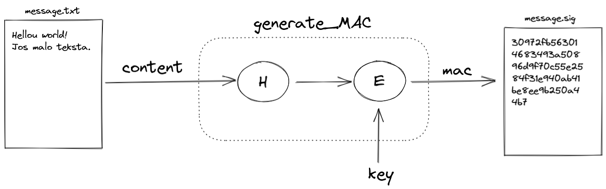

# Lab 3 - Message authentication and integrity

### Cilj

Pomoću dva mehanizma, MAC i digitalni potpis baziran na javnim kljucevima, ostvariti zastitu integriteta

### Korištene tehnologije

- Python (version 3)
    - [Cryptography](https://cryptography.io/en/latest/)
        - [HMAC](https://cryptography.io/en/latest/hazmat/primitives/mac/hmac/)
    - [Wget](https://eternallybored.org/misc/wget/)

### Podizanje radne okoline

Za ovu vježbu je korišteno virtulano python radno okuženje iz prethodne vježbe.

```bash
bdurdo/Scripts/activate
```

### MAC

### Izazov 1

Implementacija zaštite integriteta sadržaja poruke primjenom MAC algoritma (HMAC).

Generirati tekstualnu datoteku proizvoljnog sadržaja čiji intrgeitet želimo zaštiti.

Pokrenuti sljedeći kod za provjeru ispravnosti radne okoline, čija zadaća je da samo pročita datoteku te ispiše njen sadržaj.

```python
from cryptography.hazmat.primitives import hashes, hmac

def generate_MAC(key, message):
    if not isinstance(message, bytes):
        message = message.encode()

    h = hmac.HMAC(key, hashes.SHA256())
    h.update(message)
    signature = h.finalize()
    return signature

if __name__ == "__main__":
    # Reading from a file
    with open("message.txt", "rb") as file:
        content = file.read()   

    print(content)
```

> (bdurdo) C:\Users\A507\bdurdo\SRP-2021-Lab-2>python message_integrity.py
b'Hellou world!\r\nJos malo teksta.'
> 

Primjena funkcije `generate_MAC`nad textom sa zadanim kljucom `key`. 

```python
from cryptography.hazmat.primitives import hashes, hmac

def generate_MAC(key, message):
    if not isinstance(message, bytes):
        message = message.encode()

    h = hmac.HMAC(key, hashes.SHA256())
    h.update(message)
    signature = h.finalize()
    return signature

if __name__ == "__main__":
    key=b"zero entropy key"

    # Reading from a file
    with open("message.txt", "rb") as file:
        content = file.read()   

		# Print mac
    mac = generate_MAC(key,content)
    print(mac.hex())

    # Saving to a file
    with open("message.sig", "wb") as file:
        file.write(mac)
```

> (bdurdo) C:\Users\A507\bdurdo\SRP-2021-Lab-2>python message_integrity.py
30972fb563014683493a50896d9f70c55e2584f31e940ab41be8ee9b250a44b7
> 



**Provjera validnosti MAC-a za danu poruku.**

`verify_MAC` vraca true ili false za određenu kombinaciju ključa, potpisa i poruke na ulazu, te ne koristi klasicnu provjeru sa `==` koja je opasna za upotrebu.

```python
from cryptography.hazmat.primitives import hashes, hmac
from cryptography.exceptions import InvalidSignature

def verify_MAC(key, signature, message):
    if not isinstance(message, bytes):
        message = message.encode()

    h = hmac.HMAC(key, hashes.SHA256())
    h.update(message)
    try:
        h.verify(signature)
    except InvalidSignature:
        return False
    else:
        return True

if __name__ == "__main__":
    key=b"zero entropy key"

    # Reading from a file
    with open("message.txt", "rb") as file:
        content = file.read()   
		
		# Reading from a file
    with open("message.sig", "rb") as file:
        mac = file.read()   

    is_authentic=verify_MAC( key, mac, content)

    print(is_authentic)
```

.png)

> (bdurdo) C:\Users\A507\bdurdo\SRP-2021-Lab-2>python message_integrity.py
True
> 

Ukoliko dođe do promjene u tesktu, MAC-u ili ključu, makar za jedan bit, funkcija to prepoznaje.

> (bdurdo) C:\Users\A507\bdurdo\SRP-2021-Lab-2>python message_integrity.py
False
> 

### Zakljucak

Ako se promjeni ili MAC ili poruka ili ključ moći ćemo samo detektirati tu promjenu, ne mozemo znati jeli se promjena dogodila u tekstu ili MAC-u ili ključu, znamo samo da se dogodila te odbacujemo poruku.

### Izazov 2

Preuzimanje [wget](https://eternallybored.org/misc/wget/).

Spremiti wget.exe u *Scripts* direktorij projekta.

Preuzimanje svih fileova koji se nalaze u [http://a507-server.local/challenges/durdov_bozo/](http://a507-server.local/challenges/durdov_bozo/) direktoriju.

```bash
wget.exe -r -nH -np --reject "index.html*" [http://a507-server.local/challenges/durdov_bozo/](http://a507-server.local/challenges/durdov_bozo/)
```

**Algoritam za provjeru validnosti pripadajućih personaliziranih datoteka.**

```python
from cryptography.hazmat.primitives import hashes, hmac
from cryptography.exceptions import InvalidSignature

def verify_MAC(key, signature, message):
    if not isinstance(message, bytes):
        message = message.encode()

    h = hmac.HMAC(key, hashes.SHA256())
    h.update(message)
    try:
        h.verify(signature)
    except InvalidSignature:
        return False
    else:
        return True

if __name__ == "__main__":
    key = "durdov_bozo".encode()

		# Pronaci svaku putanju para datoteka key i text
    for ctr in range(1, 11):
        msg_filename = f"challenges\durdov_bozo\mac_challenge\order_{ctr}.txt"
        sig_filename = f"challenges\durdov_bozo\mac_challenge\order_{ctr}.sig"    

        # Reading from a file
        with open(msg_filename, "rb") as file:
            content = file.read()

        # Reading from a file
        with open(sig_filename, "rb") as file:
            mac = file.read() 

				# Provjera validnosti kombinacije
        is_authentic = verify_MAC( key, mac, content)

				# Ispis rezultata
        print(f'Message {content.decode():>45} {"OK" if is_authentic else "NOK":<6}')
```

.png)