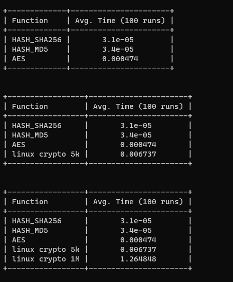

# Lab 4 - Public-key cryptography and password-hashing

### 3.1 Digital signatures using public-key cryptography

<aside>
💡 Ovaj dio laboratorijske nastavlja i završava prošlu vježbu.

</aside>

Donja slika prikazuje proceduru koju je profesor obavio, kako bi dobio potpisanu fotografiju.


[signatureProcedure.excalidraw](Lab4-Public-keyCryptographyAndPassword-hashing/signatureProcedure.excalidraw)

Također ista procedura se ponavlja i za drugu sliku ali s drugim privatnim ključem. Zatim su slike, potpisi i jedan public key uploadani na server.

Nakon što preuzmemo te podatke sa servera provodimo sljedeću proceduru kako bi provjerio jeli ispravna kombinacija slike, potpisa i javnog ključa, te tako provjerimo autentičnost.


[signatureProcedure2.excalidraw](Lab4-Public-keyCryptographyAndPassword-hashing/signatureProcedure2.excalidraw)

Ako barem jedna stvar od(slika ili potpis ili javni ključ) nije odgovarajuća, kombinacija se odbacuje kao neispravna. 

Jedna fotografija nije bila autentična, tj. narušen je integritet njenog izvora. U praksi to može značiti da je netko presreo poruku i zamijenio sliku, ili zamijenio sliku i potpis, ili samo potpis, što ne možemo precizno odrediti, samo znamo da to nije odgovarajuća kombinacija slike, potpisa i javnog ključa.

U ovom slučaju je u zadatku bilo navedeno da je potrebno odrediti autentičnu sliku koju je profesor potpisao svojim privatnim ključem, što znači da je druga fotografija potpisana ne-profesorovim privatnim ključem čiji javni ključ nemamo. Tj. Slika i potpis su odgovarajući ali to ne možemo provjeriti bez javnog ključa, ali i da imamo taj javni ključ, slika i dalje nije važeća jer to nije profesorov javni ključ.

Problem rješavamo u python-u pa stoga krećemo pokretanjem virtualnog python okruzenja koje je objašnjeno u prethodnim vježabama.

Zatim preuzimamo naš public key challenge [sa ove lokacije](http://a507-server.local/challenges/durdov_bozo/public_key_challenge/), te pripadajući javni ključ [sa ove lokacije](http://a507-server.local/challenges/public.pem).

Kod kojim smo implementirali provjeru integriteta slika:

```python
from cryptography.hazmat.primitives import hashes
from cryptography.exceptions import InvalidSignature
from cryptography.hazmat.primitives import serialization
from cryptography.hazmat.backends import default_backend
from cryptography.hazmat.primitives.asymmetric import padding

# ----------------- Loading and serialize public key -----------------
def load_public_key():
    with open(f"challenges\durdov_bozo\public_key_challenge\public.pem", "rb") as f:
        PUBLIC_KEY = serialization.load_pem_public_key(
            f.read(),
            backend=default_backend()
        )
    return PUBLIC_KEY

# ----------------- Verifying message signature -----------------

def verify_signature_rsa(signature, message):
    PUBLIC_KEY = load_public_key()
    try:
        # decrypt(PUBLIC_KEY,signature) == hash(message)
        PUBLIC_KEY.verify(
            signature,
            message,
            padding.PSS(
                mgf=padding.MGF1(hashes.SHA256()),
                salt_length=padding.PSS.MAX_LENGTH
            ),
            hashes.SHA256() #hash type - SHA256
        )
    except InvalidSignature:
        return False
    else:
        return True

if __name__ == "__main__":

    print(f'Public key:\t{load_public_key()}\n')

    for ctr in range(1, 3):
        msg_filename = f"challenges\durdov_bozo\public_key_challenge\image_{ctr}.png"
        sig_filename = f"challenges\durdov_bozo\public_key_challenge\image_{ctr}.sig"

        # Reading from a file
        with open(msg_filename, "rb") as file:
            message = file.read()

        with open(sig_filename, "rb") as file:
            signature = file.read()

        is_authentic = verify_signature_rsa(signature, message)

        print(f'Picture image_{ctr}.png: {"OK" if is_authentic else "NOK":<6}')
```

### 3.2 Password-hashing(Part 1)

<aside>
💡 Ovaj dio laboratorijske započinje 4. laboratorijsku vježbu.

</aside>

Za izvršenje ove vježbe trebamo dodatne python pakete koje instaliramo tako da [spisak paketa iz repositorija](https://github.com/mcagalj/SRP-2021-22/blob/main/password-hashing/requirements.txt) kopiramo u *requirements.txt* te pokrenemo naredbu:

`pip install -r requirements.txt`

koja instalira sve pakete navedene u *requirements.txt*.

Sporija hash funckcija utječe na napadača tako da on treba više vremena, procesne moći i memorije za generiranje riječnika. Time tako obeshrabljujemo napadača da iti pokuša izvoditi takav napad koji je neizvediv u nekom realnom vremenu. 

Sporija hash funkcija se postiže iterativnim hashiranjem.

Sljedeći kod služi za demonstraciju različiti funkcija hashiranja i usporedbe njihovi brzina.

```python
from os import urandom
from prettytable import PrettyTable
from timeit import default_timer as time
from cryptography.hazmat.backends import default_backend
from cryptography.hazmat.primitives import hashes
from cryptography.hazmat.primitives.kdf.scrypt import Scrypt
from cryptography.hazmat.primitives.ciphers import Cipher, algorithms, modes
from passlib.hash import sha512_crypt, pbkdf2_sha256, argon2

def time_it(function):
    def wrapper(*args, **kwargs):
        start_time = time()
        result = function(*args, **kwargs)
        end_time = time()
        measure = kwargs.get("measure")
        if measure:
            execution_time = end_time - start_time
            return result, execution_time
        return result
    return wrapper

# ------------- @ => dekorator -------------

@time_it
def aes(**kwargs):
    key = bytes([
        0x00, 0x01, 0x02, 0x03, 0x04, 0x05, 0x06, 0x07,
        0x08, 0x09, 0x0a, 0x0b, 0x0c, 0x0d, 0x0e, 0x0f
    ])

    plaintext = bytes([
        0x00, 0x00, 0x00, 0x00, 0x00, 0x00, 0x00, 0x00,
        0x00, 0x00, 0x00, 0x00, 0x00, 0x00, 0x00, 0x00
    ])

    encryptor = Cipher(algorithms.AES(key), modes.ECB()).encryptor()
    encryptor.update(plaintext)
    encryptor.finalize()

@time_it
def md5(input, **kwargs):
    digest = hashes.Hash(hashes.MD5(), backend=default_backend())
    digest.update(input)
    hash = digest.finalize()
    return hash.hex()

@time_it
def sha256(input, **kwargs):
    digest = hashes.Hash(hashes.SHA256(), backend=default_backend())
    digest.update(input)
    hash = digest.finalize()
    return hash.hex()

@time_it
def sha512(input, **kwargs):
    digest = hashes.Hash(hashes.SHA512(), backend=default_backend())
    digest.update(input)
    hash = digest.finalize()
    return hash.hex()

@time_it
def pbkdf2(input, **kwargs):
    # For more precise measurements we use a fixed salt
    salt = b"12QIp/Kd"
    rounds = kwargs.get("rounds", 10000)
    return pbkdf2_sha256.hash(input, salt=salt, rounds=rounds)

@time_it
def argon2_hash(input, **kwargs):
    # For more precise measurements we use a fixed salt
    salt = b"0"*22
    rounds = kwargs.get("rounds", 12)              # time_cost
    memory_cost = kwargs.get("memory_cost", 2**10)  # kibibytes
    parallelism = kwargs.get("rounds", 1)
    return argon2.using(
        salt=salt,
        rounds=rounds,
        memory_cost=memory_cost,
        parallelism=parallelism
    ).hash(input)

@time_it
def linux_hash_6(input, **kwargs):
    # For more precise measurements we use a fixed salt
    salt = "12QIp/Kd"
    return sha512_crypt.hash(input, salt=salt, rounds=5000)

# ------------- For generating Linux password hash -------------
# 5000 recursive iteration of sha512
# salt - random generated by operating system for only one user

@time_it
def linux_hash(input, **kwargs):
    # For more precise measurements we use a fixed salt
    salt = kwargs.get("salt")
    rounds = kwargs.get("rounds", 5000)
    if salt:
        return sha512_crypt.hash(input, salt=salt, rounds=rounds)
    return sha512_crypt.hash(input, rounds=rounds)

@time_it
def scrypt_hash(input, **kwargs):
    salt = kwargs.get("salt", urandom(16))
    length = kwargs.get("length", 32)
    n = kwargs.get("n", 2**14)
    r = kwargs.get("r", 8)
    p = kwargs.get("p", 1)
    kdf = Scrypt(
        salt=salt,
        length=length,
        n=n,
        r=r,
        p=p
    )
    hash = kdf.derive(input)
    return {
        "hash": hash,
        "salt": salt
    }

if __name__ == "__main__":
    ITERATIONS = 100
    password = b"super secret password"

    MEMORY_HARD_TESTS = []
    LOW_MEMORY_TESTS = []

    TESTS = [
        {
            "name": "AES",
            "service": lambda: aes(measure=True)
        },
        {
            "name": "HASH_MD5",
            "service": lambda: sha512(password, measure=True)
        },
        {
            "name": "HASH_SHA256",
            "service": lambda: sha512(password, measure=True)
        },
        {
            "name": "linux crypto 5k",
            "service": lambda: linux_hash(password, measure=True)
        },
        {
            "name": "linux crypto 1M",
            "service": lambda: linux_hash(password, rounds=10**6, measure=True)
        }
    ]

    table = PrettyTable()
    column_1 = "Function"
    column_2 = f"Avg. Time ({ITERATIONS} runs)"
    table.field_names = [column_1, column_2]
    table.align[column_1] = "l"
    table.align[column_2] = "c"
    table.sortby = column_2

    for test in TESTS:
        name = test.get("name")
        service = test.get("service")

        total_time = 0
        for iteration in range(0, ITERATIONS):
            print(f"Testing {name:>6} {iteration}/{ITERATIONS}", end="\r")
            _, execution_time = service()
            total_time += execution_time
        average_time = round(total_time/ITERATIONS, 6)
        table.add_row([name, average_time])
        print(f"{table}\n\n")
```



U našoj vježbi usporedili smo 5 tipova funkcija.

Na primjeru linux crypto 1M vidimo da smo previše usporili hashiranje sa 1M iteracija, te sami sebi možemo servirati denial of service. Ali ovaj 1M iteracija za napadača znači da, ako je izrada riječnika za jednu iteraciju 1 dan, onda je 10^5 dana(273 godine) za 1M iteracija. Tako unutar nekih okvira ovo može biti optimalno riješenje, slučajevi gdje se ne autentificiramo često i gdje postoji iznimna motivacija napadača, kao crypto wallet.

Ali i mala razlika demotivira napadača jer ne može se ubrzati izrada riječnika pararelizacijom, jedino bržim procesorom. Tj. ne može horizontalno skalirati već samo vertikalno, ali tu se brzo dostignu limiti. Takve resurse posjeduju npr. agencije za nacionalnu sigurnost.

Često nemamo potrebu za tolikom sigurnošću i želimo bržu autentifikaciju pa možemo spustiti 1M na razumljivu brojku, koja i dalje zahtjeva ogromne resurse za izradu riječnika ali korisnik se može autentificirati u roku npr. pola sekunde.

Tako da unutar naših okvira primjene tražimo optimalan omjer broja iteracija.

Osim za pohrane šifri koristi se i za izvodenje simetricni kljuceva za AES kada treba enkriptirati nešto(neka datoteka). To radimo tako da generiramo kljuc od 256b, ali gdje ga pohraniti, što ako ga izgubimo.

Alternativa korištenju 256b random generiranog ključa je uzeti lozinku s manje entropije i hashiranjem doći do kljuca, key derivation.

Ali izvođenje ključa iz šifre moze se bruteforcat(radi manje entropija), pa stoga dignemo broj iteracija, npr. na 10 sekundi, jer necemo redovito pristupat tome pa nam se isplati, ali i dalje ovisi kontekstu primjene.

Također sve ovo zahtjeva i da su korisnici educirani.